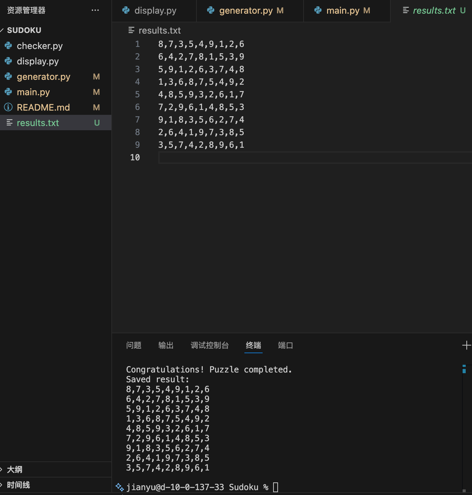

# Sudoku game (predefined puzzles version)

## File Structure
- `main.py`: Main program file: game flow, puzzle generate/load, game loop.
- `generator.py`: generating puzzles, generating complete board, random cell remove, loading predefined puzzle.
- `checker.py`: check solution status of Sudoku board, no external dependencies
- `display.py`: displaying board, saving results to file
- `README.md`: project description.

## Gameplay
1. Run `python main.py`.
2. Choose mode:
   - **Learning gameplay**: generate puzzle 20% blanks, so it's easy to fill, no fixed answer, no unique solution.
   - **Start the game**: select difficulty (Simple to Hell), load predefined puzzles that have unique solution.
3. View the displayed board (_ for blanks, [] for user inputs).
4. Input format:
   - row,col,number (e.g., 1,2,5) to fill a number
   - r,row,col (e.g., r,1,2) to remove a filled number
5. If valid, board updates; else error message.
6. Continue until completed or enter 'start' to begin the game.
7. When completed, print "Congratulations! Puzzle completed.", save results to `results.txt`, and print it to user in terminal.

## Run
Run `python main.py` to start.

## Project Requirement Checklist
- Programming Constructs: loops, selection statements (e.g., if, while), and file I/O. - main.py, checker.py, display.py, generator.py
- Data Collections: at least three distinct collections (lists, sets, or dictionaries). - lists in all files, dictionaries in main.py
- Functions and Classes: at least three functions. - checker.py, generator.py, main.py
- At least one class with at least three methods and two instance variables. - Board in generator.py, Sudoku in display.py
- Logical Flow: well-commented code and clear naming conventions. - all files
- Nested Loops and Conditions: meaningful nested loops and selection statements. - generator.py, display.py, main.py
- File I/O: read or write data to a file, with columns properly delimited. - display.py, main.py

- Use of Functions and Classes: divided into functions and classes for logical organization and reusability. - all files
